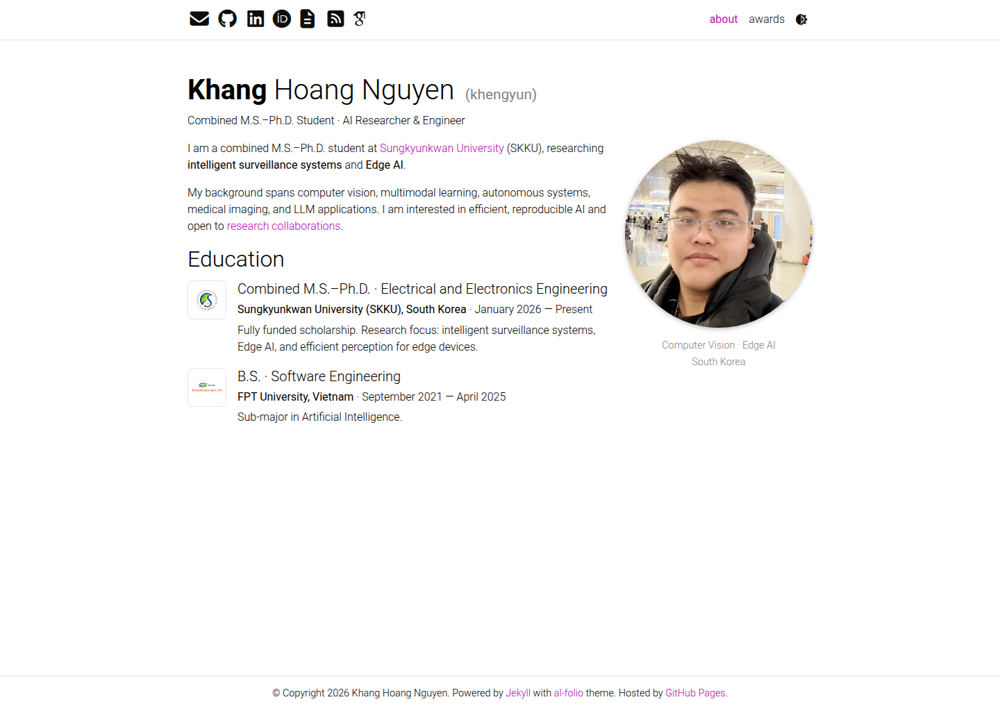

# Khang Hoang Nguyen — Personal Portfolio

[](https://khengyun.github.io/)
[](https://github.com/khengyun/khengyun.github.io/actions/workflows/deploy.yml)

[](https://khengyun.github.io/)

Personal academic and technical portfolio for **Khang Hoang Nguyen**, a combined M.S.–Ph.D.
student at Sungkyunkwan University and an AI researcher and engineer.

Visit the live site: **[khengyun.github.io](https://khengyun.github.io/)**

## Research interests

- Intelligent surveillance systems and Edge AI
- Computer vision and multimodal learning
- Medical imaging and autonomous systems
- Efficient, reproducible, and deployable AI

## Site content

- **About:** short biography and research interests
- **Education:** Sungkyunkwan University and FPT University
- **Awards:** competition achievements with certificates, event links, and photo galleries

## Profiles

- [GitHub](https://github.com/khengyun)
- [LinkedIn](https://www.linkedin.com/in/khengyun)
- [Google Scholar](https://scholar.google.com/citations?user=YpOO60MAAAAJ)
- [ORCID](https://orcid.org/0000-0003-3616-0367)
- [OpenReview](https://openreview.net/profile?id=%7EHoang-Khang_Nguyen2)

## Technology

The website is built with:

- [Jekyll](https://jekyllrb.com/)
- [al-folio](https://github.com/alshedivat/al-folio)
- GitHub Pages
- Docker for local development

## Run locally

Start the development site:

```bash
docker compose up -d
```

Open [http://127.0.0.1:8080/](http://127.0.0.1:8080/) and stop the environment when finished:

```bash
docker compose down
```

## Validation

```bash
npm ci
npm run lint:prettier
docker compose exec -T jekyll bundle exec al-folio upgrade audit --no-fail
docker compose exec -T jekyll bundle exec jekyll build
```

## Deployment

Every push to `main` runs the
[Deploy site workflow](https://github.com/khengyun/khengyun.github.io/actions/workflows/deploy.yml)
and publishes the generated site to GitHub Pages.

## Credits

Based on the [al-folio](https://github.com/alshedivat/al-folio) academic portfolio theme.
